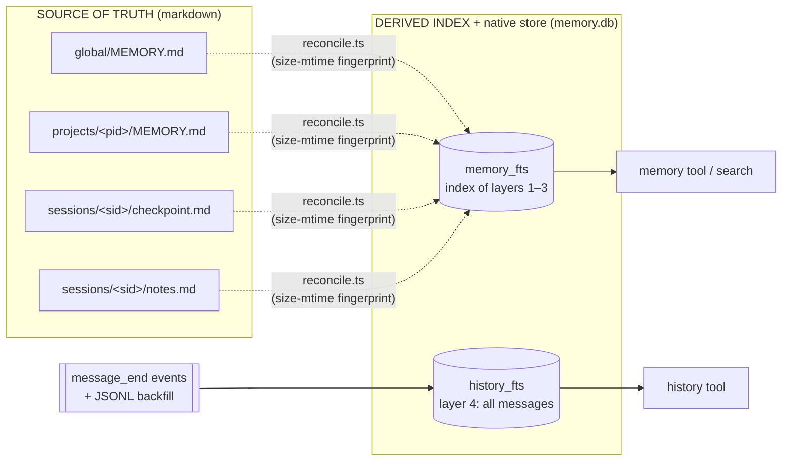
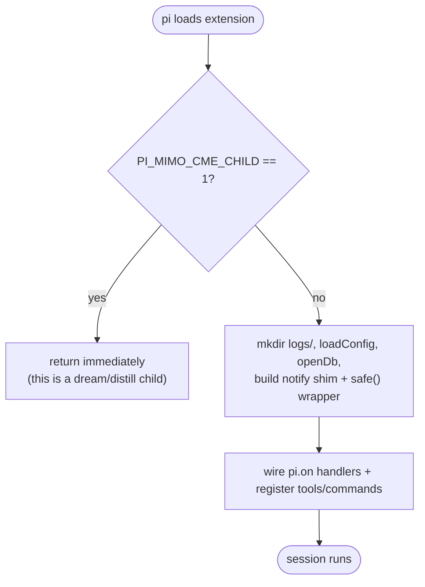
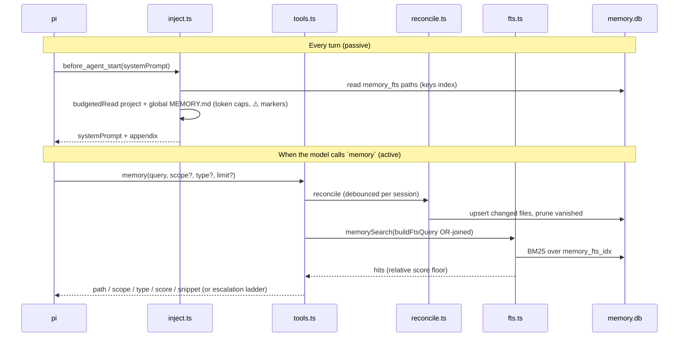
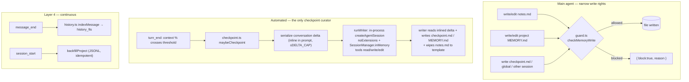
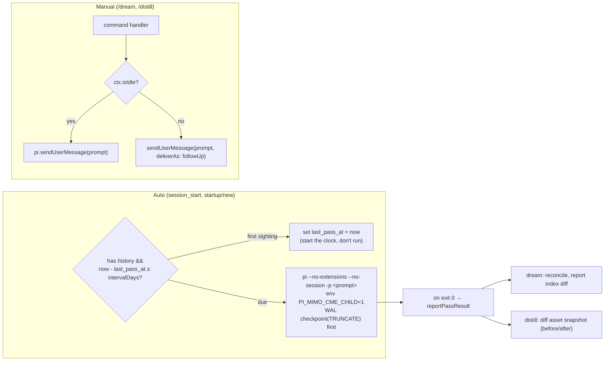

# pi-mimo-cme — Developer & Agent Guide

For anyone (human or agent) modifying this extension. It assumes you've skimmed the
[user guide](./ONBOARDING-USERS.md) so you know *what* the system does. This doc is *how* it
does it, *where* each piece lives, and *which invariants will bite you* if you touch them
carelessly.

Authoritative companions in-repo, read before large changes:
- `docs/design/SPEC.md` — the build spec (section numbers below cite it).
- `docs/research/mimo-memory-system.md` — MiMoCode's schemas and **verbatim prompts** (the
  source we adapted; checkpoint/dream/distill prompt text comes from here).
- `docs/research/pi-extension-api.md` — the pi v0.79.x extension API and its gotcha checklist.

> **Paths source of truth:** `src/paths.ts` `memoryRoot()` defines the memory root as
> `~/.pi/agent/pi-mimo-cme/` (the package name, not a generic `memory/`, so it can't
> collide with a future pi-native `memory/` feature). When a doc and the code disagree on
> a path, **`src/paths.ts` wins.**

---

## 1. Core principles (the three you must preserve)

Every change should keep these three MiMoCode principles intact. They're the *why* behind
the architecture.

1. **Computation** — give the model the right memory at the right moment, in one turn.
   Implemented as: system-prompt injection every turn (`inject.ts`), the `memory` BM25 tool
   and the `history` firehose tool (`tools.ts` + `fts.ts`), and a zero-hit escalation ladder.
2. **Memory** — keep continuity across a long, compacting session. Implemented as: the
   `notes.md` scratchpad (taught in the prompt, enforced by `guard.ts`), threshold-driven
   checkpoints (`checkpoint.ts`), and a one-shot rebuild dump after resume/fork/compaction
   (`inject.ts`).
3. **Evolution** — compound lessons across sessions. Implemented as: the **dream**
   (consolidate) and **distill** (package workflows) passes — headless `pi` subprocesses
   driven by prompts in `src/prompts/`.

And the architectural invariant that ties it together:

> **Markdown files (layers 1–3) are the source of truth. `memory.db` is a derived index
> plus the layer-4 history store. Deleting `memory.db` must lose no curated memory.**

`reconcile.ts` is what makes that true: it rebuilds index rows from files by size-mtime
fingerprint. If you ever add a write path that updates the DB *without* a corresponding file,
you've broken the invariant.



---

## 2. Repo layout & module map

Pure modules (no `pi` imports) are unit-testable under plain `node --test`; the
pi-coupled modules are wired in `index.ts`.

```
src/
  index.ts        # FACTORY. env guard, open DB, wire every pi.on handler, register tools/commands, close on shutdown
  config.ts       # DEFAULT_CONFIG + config.json overlay & validation        [pure]
  paths.ts        # memory root, pid/sid → file paths, type-from-key regex, actor tasks/ paths   [pure]  ← source of truth for layout
  db.ts           # openDb/migrate (PRAGMA user_version), schema SQL (memory_fts, history_fts, meta, actor), meta get/set
  actors.ts       # actor (subagent) ledger: pi-subagents event → actor row + progress.md; §4/rebuild renderers   [pure]
  fts.ts          # buildFtsQuery (OR + AND), memorySearch (score floor), historySearch/around   [pure-ish]
  reconcile.ts    # tree walk + fingerprint upsert/prune (+ optional "cc" scope)
  budget.ts       # token estimate + budgetedRead with truncation marker      [pure]
  templates.ts    # checkpoint (11 §) / MEMORY (4 §) / notes templates + section budgets   [pure]
  inject.ts       # system-prompt appendix assembly + rebuild-dump assembly
  history.ts      # message_end extraction, per-session seq counter, JSONL backfill
  checkpoint.ts   # usage thresholds, delta serialization, in-process writer via runWriter (queue depth 1), nudges
  guard.ts        # path guard for write/edit under the memory root           [pure]
  tools.ts        # `memory` + `history` tool definitions
  commands.ts     # /memory /dream /distill, reconcileAndNotify, status text
  prompts/
    checkpoint-writer.ts   # adapted MiMoCode checkpoint-writer prompt (template fn)
    dream.ts               # adapted dream.txt
    distill.ts             # adapted distill.txt
test/*.test.ts    # node:test over the pure/pure-ish modules
```

**Rule of thumb when adding code:** if logic can be pure, put it in a pure module and unit
test it; keep `index.ts` as thin wiring. Note pi is loaded via **jiti** and the project is
**erasable TypeScript only** (no enums, namespaces, or parameter-properties) so Node 24's
type-stripping runs `src/` and `test/` directly — see §8.

---

## 3. The factory & event wiring (`index.ts`)

The default export is the extension factory `piMimoCme(pi)`. Its job: open resources once,
attach handlers, never let a memory failure escape into the session.



### The two reliability primitives

- **`safe(name, fn)`** wraps every handler: it points the `notify` shim at the live `ctx`,
  `try/await/catch`es, and on error logs to `logs/extension.log` and shows *one* throttled
  toast (60s window). **SPEC §9.5: a memory failure must never break the session.** If you
  add a handler, wrap it in `safe()`.
- **`latestCtx` + `notify` shim.** Background work (the in-process writer, dream, distill)
  finishes *after* the handler that started it has returned, and the dream/distill children
  have no UI of their own. They surface results through `latestCtx`, which `safe()` refreshes
  on every handler call, instead of a captured-at-spawn `ctx` (pi *invalidates* a `ctx` once
  the user forks/switches sessions). The writer leans on this for more than notifications: it
  pulls `model` + `modelRegistry` from `latestCtx` at run time, because a ctx captured when
  the checkpoint was queued could be stale by the time the writer actually runs.
  **Post-`await` code must never touch a captured `ctx`** — use the `notify` shim and a
  captured plain-string `cwd` instead. This footgun is commented at every occurrence; respect
  it.

### Event → handler map

| pi event | Handler | What it does |
|---|---|---|
| `session_start` | `session_start` | set `pendingRebuild` on resume/fork; **reap stale actors** on resume; background JSONL **backfill** (`setTimeout 0`); maybe auto **dream/distill**; initial footer |
| `session_compact` | `session_compact` | set `pendingRebuild` (the rebuild dump fires next turn) |
| `before_agent_start` ①| `inject_system_prompt` | **append** memory instructions + project/global memory + keys index to `event.systemPrompt` |
| `before_agent_start` ②| `inject_rebuild` | once, if `pendingRebuild`: emit the `mimo-cme:rebuild` dump message |
| `before_agent_start` ③| `inject_nudge` | once per 70%/85% level: emit the memory-flush nudge |
| `message_end` | `message_end` | extract the finalized message into `history_fts`; refresh footer |
| `turn_end` | `turn_end` | `maybeCheckpoint()` on threshold crossing; refresh footer |
| `session_before_compact` | `session_before_compact` | force a checkpoint and `await waitForIdle(60s)` so state is captured before pi compacts |
| `tool_call` | `tool_call_guard` | block `write`/`edit` under the memory root except `notes.md` / project `MEMORY.md` (and `tasks/**`) |
| `session_shutdown` | `session_shutdown` | unsubscribe the `pi.events` bus handlers, then `db.close()` |

> **Multiple `before_agent_start` handlers are intentional.** pi accumulates the messages
> each returns and chains `systemPrompt`. That's why injection, rebuild, and nudge are three
> separate registrations — and why injection must **append** to `event.systemPrompt`, never
> replace it (replacing would clobber whatever an earlier handler added).

> **`pi.events` bus subscriptions (Phase 2, gated on `config.tasks.enabled`).** Separately from
> the `pi.on(...)` lifecycle handlers above, `index.ts` subscribes to the cross-extension bus:
> `subagents:created|started|completed|failed|compacted` → `ActorLedger.record(...)` (+ footer
> refresh), and `subagents:ready` → log. These run OUTSIDE the `safe()` path, so each wraps its
> own try/catch (a throw on the shared bus could disrupt other extensions), and their
> unsubscribe fns are collected and called on `session_shutdown`. This is how the soft
> `@tintinweb/pi-subagents` dependency is consumed — observation only, no import, no spawn RPC.

---

## 4. Read path (Computation)

How memory reaches the model. Two mechanisms: passive injection every turn, and active tools.



Key details:

- **`fts.ts` `buildFtsQuery`** turns free text into a sanitized FTS5 MATCH string. Two
  variants: **OR-joined** for the `memory` tool (recall-friendly), **AND-joined** for
  `history` (precision). Both phrase-quote unicode word-runs; a null/empty query becomes a
  guaranteed no-match (never an unsanitized MATCH — that throws in FTS5).
- **Relative score floor** (`memorySearch`): over-fetch `min(limit*3, 50)`, keep hit `i` if
  `i === 0 || score >= top*scoreFloor`. The top hit is always kept. `scoreFloor` is config
  (`0.15`; `0` disables).
- **Reconcile-on-search** is debounced per session via a `WeakMap<DatabaseSync, number>` in
  `commands.ts` (`reconcileAndNotify`). The key is the per-session DB handle, so the clock
  *cannot* be mis-shared across concurrent sessions and is GC'd on close. The first search of
  every session always reconciles; only rapid repeats within `reconcileDebounceMs` (4s)
  collapse — the tree walk is synchronous and grows with session count, so this keeps it off
  the interactive hot path.
- **`budget.ts`** estimates ~4 chars/token and, on truncation, appends MiMoCode's marker:
  `⚠️ Truncated at ~N tokens. Read("<path>", offset=M) for the rest.` so the model can fetch
  the tail itself. Per-section caps come from `config.checkpoint.pushCaps`.
- **The rebuild dump** (`buildRebuildDump`) fires once after resume/fork/compaction:
  `checkpoint.md` (11K) + `notes.md` (6K) + memory-keys (500), framed *"Resume directly. Do
  not acknowledge this memory dump."* It's **skipped silently** if the checkpoint is absent
  or all `(none yet)`. Project/global memory are deliberately *not* in this dump — they're
  already in the system prompt every turn.

---

## 5. Write path (Memory)

How memory gets persisted. Three independent writers, with very different trust levels.



### `history.ts` — layer-4 capture

- `message_end` → `indexMessage(sid, pid, message)`. User text → `user_text`; assistant text
  parts → `assistant_text`, each tool call → `tool_input` (`tool_name` + JSON preview);
  tool results with `isError` → `tool_error`. Maintains a per-session `seq` counter;
  synthetic `message_id = "<sid>#<seq>"`.
- Which kinds get stored is config (`history.kinds`); `reasoning` and `tool_output` are
  opt-in. `ALL_HISTORY_KINDS` is the union used to type the tool's filter.
- **Backfill** parses the project's past session JSONLs on `session_start`, idempotent via a
  `backfill:<file>` size-mtime fingerprint in `meta`. Runs in `setTimeout(…, 0)` so it never
  blocks startup.

### `checkpoint.ts` — the threshold-driven writer

This is the most subtle module. The invariants:

- **The main agent never writes structured memory itself; a separate writer session does.**
  `CheckpointManager` takes an injected `runWriter` dependency (defined in `index.ts`) that
  builds a fresh **in-process pi SDK session** — `createAgentSession({ tools:
  ["read","write","edit"], resourceLoader: new DefaultResourceLoader({ noExtensions: true,
  ... }), sessionManager: SessionManager.inMemory(cwd), model/modelRegistry from the live
  ctx })` — then `await session.prompt(prompt)` and `session.dispose()`. The writer prompt
  (`prompts/checkpoint-writer.ts`) carries the serialized delta **inline** (between
  `===== BEGIN CONVERSATION DELTA =====` / `===== END CONVERSATION DELTA =====` markers) and
  tells the writer to update `checkpoint.md` / `MEMORY.md` and wipe `notes.md` back to
  template — no `Read` of a temp file needed. There is no subprocess and no `delta-<n>.md`.
- **`noExtensions` is the recursion guard for the writer.** `DefaultResourceLoader({
  noExtensions: true })` loads zero extensions, so pi-mimo-cme never binds to the writer
  session (and there's no env var to set in-process). The old `PI_MIMO_CME_CHILD=1` argv
  guard — a `/usr/bin/env` wrapper because pi's `ExecOptions` has **no `env` field** — now
  applies *only* to the dream/distill subprocesses (§6); the factory still returns immediately
  when it sees that var.
- **`SessionManager.inMemory()` persists no JSONL.** This replaces the writer's old
  `--no-session` flag: a print-mode subprocess would otherwise drop its transcript into the
  very directory the layer-4 backfill scans, and the memory system would index its own writer
  output as "user conversation." (Dream/distill still pass `--no-session` for the same
  reason.)
- **Queue depth 1, newest wins.** One writer runs at a time; a new request while one is
  running replaces the pending job (its delta range is a strict superset). See
  `fireCheckpoint`/`run`. *(Unchanged by the in-process move.)*
- **Delta serialization caps** (`serializeDelta`): tool input/result clipped to 500 chars,
  whole delta capped at `DELTA_CAP` (renamed from `DELTA_FILE_CAP`; still ~100KB) by
  **dropping the head** (newest content matters most to the writer). The cap now bounds the
  *inlined* delta text — a token budget, not a file size.
- **Failure posture:** the writer mirrors pi's print mode — a thrown error, or a final
  assistant message whose `stopReason` is `"error"`/`"aborted"`, is a failure (it does *not*
  require non-empty final text; the writer is told to stay silent after its Edits). On
  success, advance `last_checkpoint_seq`; otherwise increment `consecutiveFailures` and
  **give up after `maxWriterFailures` (3)** until pi restarts.
- **`session_before_compact`** fires a checkpoint and `await waitForIdle(60_000)` so state is
  captured *before* pi compacts the context out from under us.
- **Nudges** (`nudgeFor`): at 70% and 85% usage, once per level per session, inject a
  `<system-reminder>` telling the model to flush learnings now. Crossing straight past 85%
  marks 70% too, so you never get a redundant lower nudge next turn.

### `guard.ts` — the path guard

`checkMemoryWrite(root, sid, pid, targetPath, cwd)` intercepts `write`/`edit` tool calls
whose resolved path is under the memory root and allows **only** the current session's
`notes.md` and the current project's `MEMORY.md`. Everything else under the root
(`checkpoint.md`, `global/`, other sessions/projects) is blocked with a reason quoting the
rules (*"checkpoint.md is the writer's domain"*, *"no learning.md / scratch.md — use
notes.md"*). Writes **outside** the memory root are never touched. The in-process writer
session (loaded with `noExtensions`) and the dream/distill subprocesses run without the
extension, so the guard doesn't apply to them.

---

## 6. Evolution path (`maybeAutoPass`, `prompts/dream.ts`, `prompts/distill.ts`)

Both passes share a shape: a prompt template fed to a headless `pi` child, run either
automatically on a `meta`-tracked interval or manually via a slash command.



Things to know:

- **Auto-pass scheduling lives in `meta`** (`last_dream_at:<pid>`, `last_distill_at:<pid>`),
  not session titles. The **first sighting of a project sets the clock** rather than running
  immediately — no surprise dream on a fresh install.
- **`dream.auto` defaults on (7d); `distill.auto` defaults on (30d)** — both match MiMoCode.
  Distill creates skills/extensions, which is more invasive than editing Markdown, so it stays
  easy to opt out of (`"distill": { "auto": false }`), but it is no longer off by default.
- **Honest result reporting** (`reportPassResult`): a dream's effect is read from the
  reconcile index diff (it edited Markdown); a distill's effect is the set of asset files
  that newly exist between a *before* snapshot (captured at spawn) and an *after* snapshot —
  never the child's freeform stdout. `assetSnapshot` walks `~/.pi/agent/skills|extensions`
  and `<cwd>/.pi/skills|extensions`.
- **`PRAGMA wal_checkpoint(TRUNCATE)` before spawning.** The child reads `memory.db`
  read-only through the `sqlite3` CLI; flushing committed WAL frames into the main file first
  makes this session's writes visible to it (and bounds the WAL).
- The dream/distill prompts document **our** `history` schema (`history(seq, session_id,
  project_id, kind, tool_name, body, time_created)`) for their SQL phase — not MiMoCode's
  part-id schema. If you change the schema, update those prompts.

---

## 7. Storage schema (`db.ts`)

`node:sqlite` `DatabaseSync` (synchronous). WAL mode, `busy_timeout=2000`. Migrations are a
sequential array gated by `PRAGMA user_version` — **append a new SQL string to `MIGRATIONS`
to evolve the schema; never edit an existing migration.**

External-content FTS5 (`content='…'`, `content_rowid='id'`,
`tokenize='unicode61 remove_diacritics 1'`) for both `memory_fts` and `history_fts`:

```
memory_fts(id, path UNIQUE, scope, scope_id, type, body, fingerprint, last_indexed_at)
            scope ∈ global | projects | sessions | cc ;  fingerprint = "<size>-<mtimeMs>"
history_fts(id, session_id, project_id, seq, kind, tool_name, body, time_created)
            UNIQUE(session_id, seq)
meta(key TEXT PRIMARY KEY, value TEXT)   -- last_checkpoint_seq:<sid>, crossed:<sid>,
                                         -- last_dream_at:<pid>,
                                         -- last_distill_at:<pid>, backfill:<file>
actor(session_id, id, project_id, type, description, status, tokens, tool_uses,   -- Phase 2 (SCHEMA_V2)
      compaction_count, result_summary, error, created_at, updated_at, completed_at)
            PRIMARY KEY(session_id, id) ;  status ∈ created|running|completed|error|stopped
            -- DERIVED from pi-subagents events; the durable artifact is the per-actor
            -- progress.md journal on disk (indexed into memory_fts as type='progress')
```

> `actor` is a plain table, **not** an FTS vtab — it's a structured ledger queried by
> `session_id`/`status`, while the searchable *content* (the progress.md journals) flows through
> `memory_fts` via the normal reconcile walk. So the FTS war story below doesn't apply to it.

> 🔥 **The FTS5 war story — do not "simplify" the delete triggers.** For external-content
> FTS5, removing a row's tokens requires the *magic command form*:
> `INSERT INTO memory_fts_idx(memory_fts_idx, rowid, body) VALUES('delete', OLD.id, OLD.body)`
> A plain `DELETE FROM memory_fts_idx` is *contentless-mode* syntax; applied to
> external-content mode it leaves stale tokens accumulating until the vtab corrupts.
> MiMoCode hit this; the comment in `db.ts` preserves the war story. The `AFTER UPDATE`
> trigger does delete-then-insert for the same reason. Touch these only if you truly
> understand FTS5 modes.

---

## 8. Build, test, typecheck

No build step — pi loads the TS directly via jiti, and Node 24 type-strips for tests.

```sh
npm install            # dev deps only: @earendil-works/pi-{ai,coding-agent}, typebox, types
npm run typecheck      # tsc --noEmit  → must be clean
npm test               # node --test 'test/*.test.ts'  → must be green
```

**Engineering constraints (SPEC §9) that the test/typecheck gates enforce:**

1. **Erasable TypeScript only** — no `enum`, `namespace`, or parameter-properties, so Node's
   type-stripping runs `src` and tests unmodified. (Use `as const` + `StringEnum` for enums;
   see `tools.ts`.)
2. Wrap every event handler in `safe()`; memory failures log + one-shot toast, never throw
   into the session.
3. Multi-statement DB writes go in transactions (see `migrate`).
4. Never delete user Markdown in our code. The only wipe is `notes.md` → template, and that
   happens *in the in-process writer session via its prompt*, not in our code.
5. Tests use `fs.mkdtempSync` + `PI_CODING_AGENT_DIR` override so they never touch the real
   `~/.pi`. Existing coverage: `buildFtsQuery` (OR/AND, punctuation, empty), score floor,
   fingerprint reconcile (add/change/delete), history kind extraction, around-windowing,
   budgeted-read truncation marker, the guard allow/deny matrix, pid hashing, delta caps.

### Smoke test against real pi (cheap)

```sh
# 1) Loads & exits 0
PI_CODING_AGENT_DIR=$(mktemp -d) pi --no-extensions -e ./src/index.ts -p "Reply with exactly: ok"

# 2) Proves tool registration + FTS round-trip
PI_CODING_AGENT_DIR=$(mktemp -d) pi -e ./src/index.ts \
  -p "Call the memory tool with query 'anything' and report its output"

# 3) Inspect the temp DB the smoke run created
sqlite3 "$PI_CODING_AGENT_DIR/pi-mimo-cme/memory.db" ".tables"
```

**Phase 2 subagent layer — full live verification:**

```sh
# Isolated agent dir, installs @tintinweb/pi-subagents, spawns a real background
# subagent, then asserts the actor row + progress.md journal + §4 block. Borrows
# your real auth.json so the headless run authenticates. KEEP=1 preserves the dir.
KEEP=1 ./scripts/smoke-subagents.sh
```

This is the only check that proves the live `pi.events` channel names + payload shapes
(notably `tokens` as a `{input,output,total}` object) match `actors.ts` — unit tests
author their own payloads and so can't. It already caught one real bug (tokens stored as
0). Background subagents are required: foreground ones emit no terminal event (see §11.6).

---

## 9. Extending it — recipes

**Add a config option.** Add the field + default to `DEFAULT_CONFIG` (`config.ts`), then a
validated branch in `mergeConfig` (it ignores wrong types rather than throwing). Read it
through `deps.config.…`. Document it in the README and the user guide.

**Add a slash command.** Register in `registerCommands` (`commands.ts`). For commands that
hand work to the agent, use the `sendManualPass` pattern: `pi.sendUserMessage` throws while
the agent is streaming, so guard on `ctx.isIdle()` and fall back to
`{ deliverAs: "followUp" }`.

**Add a tool.** Define it in `tools.ts` with a TypeBox `Type.Object` schema (`StringEnum`
from `@earendil-works/pi-ai` for enums — *not* TS enums). Set `executionMode: "sequential"`
for write-ordering clarity. Truncate any large output (the `history` around tool caps at
`AROUND_MAX_BYTES`).

**Change the schema.** Append a migration string to `MIGRATIONS` in `db.ts` (never edit an
existing one) — `user_version` advances one per element. If you add/rename a `history_fts`
column, update the SQL templates inside `prompts/dream.ts` and `prompts/distill.ts`.

**Add a memory scope or layer.** Touch `paths.ts` (path helpers + `scope`), `reconcile.ts`
(so the tree walk indexes it), and `inject.ts` (if it should be injected). Keep the source-of-
truth invariant: a new layer is Markdown first, index second.

**Add a `before_agent_start` contribution.** Register another `before_agent_start` handler
(they accumulate) and **append** to `event.systemPrompt`; never replace it.

---

## 10. Pitfalls checklist (the ones that have bitten)

- ❌ Returning `{ systemPrompt: appendix }` instead of `event.systemPrompt + appendix` —
  clobbers earlier handlers' prompt and the base prompt.
- ❌ Touching a captured `ctx` after an `await` — pi may have invalidated it. Capture a plain
  `cwd` string and use the `notify` shim.
- ❌ Forgetting `--no-session` on a spawned dream/distill child (or `SessionManager.inMemory`
  for the in-process writer) — its transcript pollutes the backfill dir.
- ❌ Forgetting the `PI_MIMO_CME_CHILD=1` env wrapper on a dream/distill child (or assuming
  `ExecOptions.env` exists), or loading the writer session without `noExtensions` — infinite
  extension recursion.
- ❌ Plain `DELETE FROM <fts_idx>` in a trigger — corrupts the external-content vtab (§7).
- ❌ Writing to the DB without a matching file write — breaks "delete memory.db loses
  nothing."
- ❌ Editing an existing entry in `MIGRATIONS` — `user_version` won't re-run it; add a new one.
- ❌ Unsanitized text into an FTS5 `MATCH` — throws. Always go through `buildFtsQuery`.
- ❌ A handler that can throw without `safe()` — a memory bug becomes a session-breaking bug.

---

## 11. Deliberate divergences from MiMoCode

Documented in full in the README; the load-bearing ones for a developer:

1. **Project/global memory ride in the system prompt every turn** (MiMo injects only at
   rebuild). pi sessions may never compact, so we always carry the small upper layers; the
   text is stable so the prompt cache stays warm.
2. **Window-scaled `"auto"` thresholds** (matches MiMo: every 20% ≤200K, 10% to 500K, 5% beyond); a flat array like `[20,40,60,80]` opts out.
3. ~~**Distill auto-off by default.**~~ **Distill auto-on (30d), matching MiMoCode** — opt out with `"distill": { "auto": false }`.
4. **No preStop validators in v1** — the writer prompt's budget text and dream's prune phase
   carry that pressure instead.
5. **In-process writer fed an inlined delta** (`createAgentSession` +
   `SessionManager.inMemory` + a `noExtensions` resource loader), not a subprocess and not a
   forked context. Removing the subprocess and the temp file also fixes parent-state access
   (the writer takes `model`/`modelRegistry` live from the parent ctx). It does **not** restore
   prefix-cache reuse — the writer is still a separate conversation with its own system prompt
   and tool schema, so the delta stays a condensed text handoff. True reuse would need
   MiMoCode's `fork=true` (the parent's full prefix + tool schema), which even MiMoCode leaves
   off by default. Dream/distill remain subprocesses.
6. **Actor (subagent) ledger, no user task graph** — `checkpoint.md §4` (renamed Task tree →
   Subagents) is reconciled from `actors.ts`, which observes `@tintinweb/pi-subagents` events
   over `pi.events` (soft/optional dep). We get the *actor* half (who ran, status, result), not
   MiMoCode's user *task graph* (`task`/`task_event`). pi-subagents absent ⇒ §4 renders
   "(no subagents this session)". Gate with `"tasks": { "enabled": false }`. **Scoped to
   background subagents:** pi-subagents emits `created` + terminal `completed`/`failed` only for
   background agents (foreground agents emit just `started` and return inline → already in the
   delta), so `created` is the sole row-introducer and other phases are gated on an existing row
   (also absorbs the `started`-before-`created` ordering). `tokens` is a `{input,output,total}`
   object, not a scalar (`asTokenCount` unwraps it). Verified live via
   `scripts/smoke-subagents.sh`.
7. **History keyed by `(session_id, seq)`** with synthetic `message_id = "<sid>#<seq>"` — pi
   exposes messages, not parts.
8. **Auto-pass scheduling in `meta`**, first sighting starts the clock.

---

## 12. Map back to the spec

| Want the rationale for… | Read |
|---|---|
| Storage layout, scope/type detection | SPEC §1–§2, `paths.ts`, `db.ts` |
| Injection & tools (read path) | SPEC §3, `inject.ts`, `tools.ts`, `fts.ts`, `budget.ts` |
| History indexing, notes, checkpoint writer, guard | SPEC §4, `history.ts`, `checkpoint.ts`, `guard.ts` |
| Dream / distill / promotion ladder | SPEC §5, `prompts/*`, `index.ts maybeAutoPass` |
| Commands & UI | SPEC §6, `commands.ts`, `index.ts refreshStatus` |
| Config | SPEC §8, `config.ts` |
| Engineering constraints & acceptance checks | SPEC §9–§10 |
| Verbatim MiMoCode prompts/templates we adapted | `docs/research/mimo-memory-system.md` |
| pi v0.79.x API + gotcha checklist | `docs/research/pi-extension-api.md` |
