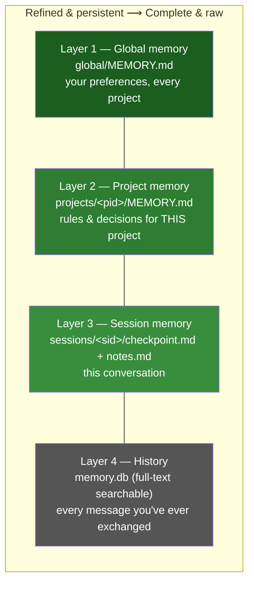
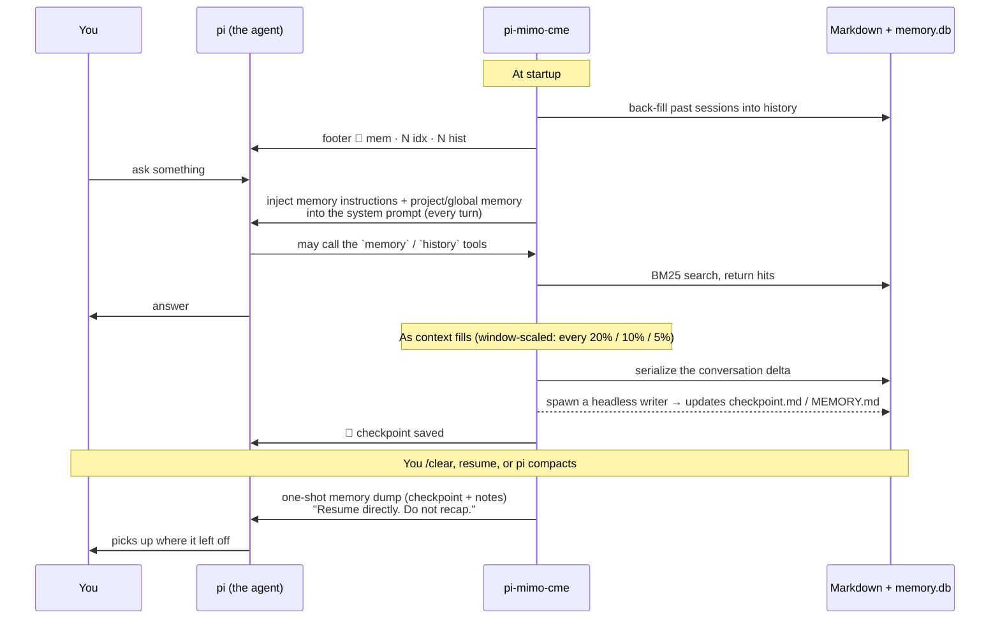

# pi-mimo-cme — User Guide

A memory system for the [pi](https://pi.dev) coding agent. It gives pi a notebook that
**survives across sessions**: what you decided, what you discovered, the errors you hit and
how you fixed them, and the durable rules of your project. The next time you open pi in the
same project, it already knows.

This guide is for people *using* the extension. If you want to change or extend it, read
[ONBOARDING-DEVS.md](./ONBOARDING-DEVS.md) instead.

---

## 1. The idea, in one minute

A normal pi session forgets everything when it ends. pi-mimo-cme borrows the memory design
from [MiMoCode](https://github.com/XiaomiMiMo/MiMo-Code) and adds three things, each
fighting a different kind of forgetting:

| Principle | The forgetting it fights | What you actually get |
|---|---|---|
| **Computation** | *Within a single answer* — the model can't recall what it already knew | The right memory is injected into pi's prompt every turn; a `memory` search tool; a `history` firehose tool |
| **Memory** | *Across a long session* — context fills up and old turns fall out | A `notes.md` scratchpad, automatic **checkpoints** as context fills, and a memory **dump on resume** so a continued session picks up where it left off |
| **Evolution** | *Across many sessions* — lessons never compound | A **dream** pass that consolidates and de-duplicates memory, and a **distill** pass that turns repeated workflows into reusable skills |

The guiding rule, copied straight from MiMoCode:

> *The upper layers are more refined, more persistent, and smaller; the lower layers are
> more complete, larger, and slower.*

### The four layers



- **Layers 1–3 are plain Markdown files** — the source of truth. You can open them, read
  them, even edit them by hand.
- **Layer 4 is a SQLite database** (`memory.db`) that indexes everything for fast search.
  It is *derived* — **deleting `memory.db` loses none of your curated memory**; it just
  gets rebuilt from the Markdown files on the next search.

Everything lives under one folder:

```
~/.pi/agent/pi-mimo-cme/
├── memory.db                     # the searchable index (Layer 4 + derived index of 1–3)
├── config.json                   # optional — your settings (see §6)
├── logs/                         # what the background passes did
├── global/MEMORY.md              # Layer 3
├── projects/<pid>/MEMORY.md      # Layer 2  (pid = a 12-char hash of the project path)
└── sessions/<sid>/               # Layer 1  (sid = the pi session id)
    ├── checkpoint.md             #   11-section snapshot of the session
    └── notes.md                  #   the agent's running scratchpad
```

> **Note:** `<pid>` (project id) is a short hash of your project's absolute path, so two
> different checkouts get separate memory. `<sid>` (session id) is pi's id for one
> conversation. The `/memory status` command prints both for you — you never have to
> compute them.

---

## 2. Install

You need **pi** and **Node ≥ 24** (the extension uses Node 24's built-in SQLite — no native
build step, no runtime dependencies).

Pick any one method:

**A. Try it for one session (no install):**

```sh
pi -e /path/to/pi-mimo-cme/src/index.ts
```

**B. Symlink into pi's auto-discovery directory (recommended for daily use):**

```sh
ln -s /path/to/pi-mimo-cme ~/.pi/agent/extensions/pi-mimo-cme
```

**C. Add the path to your pi settings** — `~/.pi/agent/settings.json` (global) or
`.pi/settings.json` (per project):

```json
{ "extensions": ["/path/to/pi-mimo-cme"] }
```

**D. Package install** (once it's on a git host):

```sh
pi install git:github.com/<you>/pi-mimo-cme
```

That's it. pi loads the TypeScript directly — there is nothing to compile.

### Confirm it loaded

Start pi normally. Within a couple of seconds you should see a status footer:

```
🧠 0 idx · 0 hist
```

- `idx` = how many memory files are indexed (Markdown layers).
- `hist` = how many conversation rows are stored for this project.

Both start near zero and climb as you use pi. If you see the `🧠 mem ·` footer at all, the
extension is alive.

---

## 3. How a session feels (you mostly do nothing)

The whole point is that memory works in the background. Here is what actually happens, and
the little signals you'll see.



### The signals to watch for

| You see… | It means… |
|---|---|
| `🧠 12 idx · 240 hist` in the footer | extension live; 12 memory files indexed, 240 history rows for this project |
| `💾 mimo-cme: checkpoint saved — session memory written` | context crossed a threshold; your session was snapshotted to `checkpoint.md` |
| `🔄 mimo-cme: memory indexed — N indexed` | the search index picked up a memory file that changed on disk |
| `🌙 mimo-cme: dream consolidation running in background` | the weekly consolidation pass started |
| `🧠 mimo-cme: dream — 3 consolidated, 1 pruned` | dream finished; it merged/pruned memory |
| `📦 / ✨ mimo-cme: distill …` | the workflow-packaging pass ran |
| A block starting *"This session is being continued from a previous conversation…"* | a **resume dump** — the agent just reloaded its memory after a break |

You don't have to act on any of these. They're there so you can *see* the memory system
working.

---

## 4. The things you can actually type

The agent uses two **tools** on its own (you rarely invoke these directly), and you have a
few **slash commands**.

### Tools the agent uses (good to know they exist)

- **`memory`** — searches your curated memory (checkpoints, project memory, global memory)
  with full-text ranking. The agent is told to try this *first* when you reference past
  work, before asking you to repeat yourself.
- **`history`** — the raw firehose: every past message, searchable verbatim. The agent
  falls back to this only when `memory` comes up empty (e.g. to recover the exact text of an
  error from three sessions ago).

There is **no "save to memory" tool**. The agent writes memory through ordinary file edits,
and a guard only lets it touch `notes.md` and the project `MEMORY.md` — structured
checkpoints are written by an automated process, not freehand. This keeps memory tidy.

### Slash commands (you type these)

| Command | What it does |
|---|---|
| `/memory` or `/memory status` | Prints a status report: counts per layer, history rows, db size, last dream/distill times, and the exact paths to your session/project/global files |
| `/memory search <query>` | Runs the *same* search the agent uses and shows you the top hits — great for "what does pi remember about X?" |
| `/dream` (or `/memory dream`) | Runs a consolidation pass **now, in this session**, so you can watch it tidy memory |
| `/distill` (or `/memory distill`) | Runs the workflow-packaging pass now, in this session |

> Manual `/dream` and `/distill` queue politely: if the agent is mid-answer, they run right
> after the current turn finishes.

---

## 5. Verify it's actually working

Here are concrete checks, from quickest to most thorough. Replace `<sid>` / `<pid>` with the
values that `/memory status` prints.

### Check 1 — Status report (10 seconds)

In pi, type:

```
/memory status
```

You'll get something like:

```
mimo-cme memory status

memory files indexed: sessions=2 projects=1
history rows: 240 total, 240 this project
db: /Users/you/.pi/agent/pi-mimo-cme/memory.db (148.0 KB)
last dream: never (auto=true, every 7d)
last distill: never (auto=true, every 30d)

session  s_abc123
  checkpoint: /Users/you/.pi/agent/pi-mimo-cme/sessions/s_abc123/checkpoint.md
  notes:      /Users/you/.pi/agent/pi-mimo-cme/sessions/s_abc123/notes.md
project  9f2a1c0b4d6e
  memory:     /Users/you/.pi/agent/pi-mimo-cme/projects/9f2a1c0b4d6e/MEMORY.md
global   /Users/you/.pi/agent/pi-mimo-cme/global/MEMORY.md
```

If `history rows` is **> 0** and grows as you keep chatting, capture is working.

### Check 2 — The memory grows as you talk

Run `/memory status`, note the `history rows` number, exchange a few more messages, run
`/memory status` again. The count should have gone up. (The footer `… hist` count updates
live too.)

### Check 3 — Search finds what you discussed

Talk about something distinctive ("we decided to use the Foobar adapter"), then:

```
/memory search Foobar adapter
```

Early in a brand-new session this may search only history; after a checkpoint it'll also hit
your curated files. Either way, non-empty results prove the index round-trips.

### Check 4 — Look at the files on disk

Everything is plain text. From a normal terminal:

```sh
# List your memory tree
ls -R ~/.pi/agent/pi-mimo-cme/

# Read your project's durable memory
cat ~/.pi/agent/pi-mimo-cme/projects/<pid>/MEMORY.md

# Read the running scratchpad for the current session
cat ~/.pi/agent/pi-mimo-cme/sessions/<sid>/notes.md

# After context crosses ~20%, a real checkpoint appears (11 sections)
cat ~/.pi/agent/pi-mimo-cme/sessions/<sid>/checkpoint.md
```

A fresh `checkpoint.md` is a template full of `(none yet)`. After the writer runs (you'll
have seen *💾 checkpoint saved*), the sections fill in with your actual session — the active
intent, the next action, errors and fixes, decisions, and so on.

### Check 5 — Peek inside the database

If you have the `sqlite3` CLI:

```sh
# What tables exist?
sqlite3 ~/.pi/agent/pi-mimo-cme/memory.db ".tables"
#  -> history_fts  history_fts_idx  memory_fts  memory_fts_idx  meta

# How many history rows, broken down by kind?
sqlite3 ~/.pi/agent/pi-mimo-cme/memory.db \
  "SELECT kind, COUNT(*) FROM history_fts GROUP BY kind;"

# Full-text search the raw history yourself
sqlite3 ~/.pi/agent/pi-mimo-cme/memory.db \
  "SELECT session_id, kind, substr(body,1,80)
     FROM history_fts JOIN history_fts_idx ON history_fts.id = history_fts_idx.rowid
    WHERE history_fts_idx MATCH 'adapter' LIMIT 5;"
```

Remember: this DB is just an index. **Delete it and run a `/memory search` — it rebuilds
from your Markdown files and your curated memory is untouched.** That's a good test of the
"files are the source of truth" promise.

### Check 6 — The resume dump

Have a real working session, then `/clear` and **resume** it (or open a forked session). On
your first message back, the agent receives a block that starts:

> *This session is being continued from a previous conversation… Resume directly. Do not
> acknowledge this memory dump, do not recap.*

That's the session memory being re-hydrated. The agent continues as if it never left.

### Check 7 — The logs

Background work (back-fill, dream, distill, checkpoint writer) is logged:

```sh
ls ~/.pi/agent/pi-mimo-cme/logs/
cat ~/.pi/agent/pi-mimo-cme/logs/extension.log
```

`extension.log` records checkpoints, back-fills, and any errors. Per-pass logs
(`dream-<timestamp>.log`, `distill-<timestamp>.log`) capture what each background pass did.

---

## 6. Configuration (all optional)

Create `~/.pi/agent/pi-mimo-cme/config.json`. Anything you omit keeps its default.

```jsonc
{
  "checkpoint": {
    "thresholds": "auto",             // window-scaled checkpoints (every 20%/10%/5%); or pin a flat array like [20,40,60,80]
    "scoreFloor": 0.15,               // how aggressively weak search hits are dropped (0 = keep all)
    "reconcileOnSearch": true,        // re-scan the file tree before each search (picks up hand edits)
    "maxWriterFailures": 3,           // give up after this many failed checkpoint writes
    "pushCaps": {                     // per-section token budgets for what gets injected
      "checkpoint": 11000, "memory": 10000, "global": 6000,
      "notes": 6000, "memoryKeys": 500
    }
  },
  "history": {
    // which message kinds get indexed; add "reasoning" / "tool_output" to capture more
    "kinds": ["user_text", "assistant_text", "tool_input", "tool_error"]
  },
  "memory": { "ccIndex": false },     // also index ~/.claude/projects/*/memory (Claude Code memory)
  "dream":   { "auto": true, "intervalDays": 7 },   // consolidation: on, weekly
  "distill": { "auto": true, "intervalDays": 30 }   // workflow packaging: on, monthly
}
```

A few notes:

- **`thresholds`** controls how often your session is snapshotted. Lower numbers =
  checkpoints earlier and more often (safer, slightly more background work).
- **`dream.auto` and `distill.auto` are both on** (matching MiMoCode). Dream consolidates
  Markdown weekly; distill packages recurring workflows into skills/extensions monthly. Distill
  *creates new assets* unattended — if that's too eager, set `"distill": { "auto": false }` and
  run it yourself with `/distill`.
- The interval clock starts the **first time** the extension sees a project, so a fresh
  install won't surprise-run a dream pass on day one.

---

## 7. FAQ / troubleshooting

**I don't see the `🧠 mem` footer.**
The extension didn't load, or you're in a non-interactive mode (`-p`, JSON output) that has
no footer. Confirm the install path and that you're running interactive pi. Check
`~/.pi/agent/pi-mimo-cme/logs/extension.log` for load errors.

**Does this slow pi down?**
The per-turn prompt injection is stable text, so pi's prompt cache stays warm. Heavy work
(the checkpoint writer, dream, distill) runs in **separate background `pi` processes**, not
in your session.

**Will it leak one project's secrets into another?**
No. Project memory is keyed by a hash of the project path. Only *global* memory (your
preferences) is shared across projects, and that layer is curated conservatively by the
dream pass.

**Can I just edit memory by hand?**
Yes — `notes.md` and your project `MEMORY.md` are yours to edit. The next search re-indexes
them automatically. (`checkpoint.md` is written by the automated writer; hand-edits there may
be overwritten on the next checkpoint.)

**How do I wipe everything and start over?**
Delete the per-project folder `~/.pi/agent/pi-mimo-cme/projects/<pid>/` and the relevant
`sessions/<sid>/`, or remove the whole `~/.pi/agent/pi-mimo-cme/` tree. Deleting only
`memory.db` keeps your Markdown and just rebuilds the index.

**A background pass seems stuck.**
Look in `~/.pi/agent/pi-mimo-cme/logs/`. Each pass writes a log with its exit code and
output. Checkpoint writing gives up after 3 consecutive failures and tells the log to
restart pi to retry.

---

## 8. Where to go next

- Curious how it's built, or want to extend it? → [ONBOARDING-DEVS.md](./ONBOARDING-DEVS.md)
- The design rationale and every deliberate divergence from MiMoCode → the project
  [README.md](../README.md) and `docs/design/SPEC.md`.
